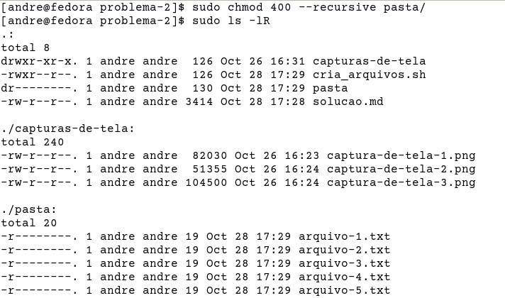

# Problema 2

> Crie uma Pasta qualquer e 5 arquivos de texto. Em seguida define as permissões 400 para a pasta e todos os arquivos recursivamente. Use esse exemplo para explicar o que são as permissões de arquivo no Linux e como elas são representadas de forma mais detalhada possível.

# Solução do problema 2

A descrição do problema pede que uma permissão numérica seja aplicada recursivamente a um diretório e cinco arquivos dentro dele. A permissão numérica 400 representa a permissão simbólica "w--------". Essa permissão significa que usuário dono do diretório e dos arquivos - e somente ele - terá acesso de leitura, mas não de escrita ou execução. Qualquer outro usuário não-*root* não terá qualquer permissão sobre esse diretório e esses arquivos.

## Criando o diretório e os arquivos

Nessa parte utilizei um *script*, que chamei de *cria_arquivos.sh*, porque imaginei que teria de executar esse teste mais de uma vez. O conteúdo do *script* era o seguinte:

    #!/bin/bash
    mkdir ./pasta
    i=1
    while [ $i -le 5 ]
    do
        echo "Texto do arquivo $i" > ./pasta/arquivo-$i.txt
        ((i++))
    done

Após rodar o *script*, havia a seguinte estrutura de diretórios e arquivos.

## Mudando as permissões

Após criar o diretório e os arquivos, o comando executado conforme a descrição do problema foi:

    $ chmod 400 --recursive pasta/

O resultado desse comando, no entanto, foram várias mensagens de erro. Uma para cada arquivo.

Acontece que, ao mudar as permissões do diretório para somente leitura pelo usuário dono, perdemos acesso aos arquivos dentro do diretório. A execução recursiva do comando não consegue modificar os arquivos dentro do diretório, apesar de saber que eles existem.

## Discussão sobre permissões

Ao executar o comando `ls -lR` novamente, ainda é possível visualizar os arquivos dentro do diretório. Porém qualquer ação, como listar suas permissões, não pode ser executada.

Isso ocorre porque a permissão de execução em um diretório influencia outras permissões. Até é possível listar os arquivos em um diretório sem premissão de execução (fazendo uso da permissão de leitura). No entanto, não é possível executar operações nesse diretório, como criar ou deletar arquivos, entrar no diretório e, nesse caso, listar ou modificar as permissões dos arquivos dentro do diretório.

## Utilizando o comando `sudo`

O comando `sudo` permite que usuários não-*root* executem comandos com os privilégios do usuário *root*. Para isso, é necessário que eles estejam configurados no arquivo `/etc/sudoers`, ou que pertençam a um grupo configurado no mesmo arquivo.

No caso do Fedora, existe um grupo chamado *wheel* já configurado. O usuário *andre*, usado nos exemplos desse documento, está nesse grupo. Portanto ele pode utilizar o comando `sudo` como nos exemplos a seguir.

A permissão de *root* concedida pelo comando `sudo` se sobrepõe às permissões de usuário configuradas nos arquivos e diretórios. Por isso foi possível acessar os arquivos no diretório `pasta`, mesmo sem ter a permissão de execução definida para o usuário.

## Referências

CARRIGAN, Tyler. **Linux command line basics: sudo**. RedHat: Enable SysAdmin. 2020. Disponível em: https://www.redhat.com/sysadmin/sudo. Acesso em: 28 de outubro de 2023.

JAHODA, Mirek; SINHA, Ankur. **Adding a user to sudoers**. Fedora Docs: Quick Docs - Usage and customisation. 2023. Diponível em: https://docs.fedoraproject.org/en-US/quick-docs/adding_user_to_sudoersi_file. Acesso em: 26 de outubro de 2023.

MCBRIEN, Scott. **Linux file permissions-explained**. RedHat: Enable SysAdmin. 2023. Disponível em: https://www.redhat.com/sysadmin/linux-file-permissions-explained. Acesso em: 26 de outubro de 2023.
