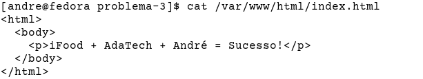

# Problema 3

> Descreva o processo para instalar e configurar o servidor web Apache2 (httpd) no Linux. O Objetivo é alterar a página padrão do Apache para os seguintes caracteres:

> iFood + AdaTech + seu_nome = Sucesso!

## Instalando o Apache2 no Fedora

No Fedora, o gerenciador de pacotes é o `dnf`, e o pacote do Apache2 é o `httpd`. Logo, o comando de instalação do Apache2 no Fedora é o seguinte:

    # dnf install httpd -y

Após concluída a instalação, é necessário iniciar o serviço do Apache2. O comando é o seguinte:

    # systemctl start httpd

Para ativar o serviço e mantê-lo rodado mesmo após reiniciar a máquina, é preciso utilizar um comando próprio do `systemctl` para isso:

    # systemctl enable httpd

Agora, verificamos o estado do serviço com o seguinte comando:

    # systemctl status httpd

O resultado deve ser como na seguinte imagem.

## Modificação do conteúdo

Nesse momento, o serviço do Apache2 está em execução e é possível verificar isso visitando o endereço *localhost* em um navegador web.

Para mudar o que exibido, basta adicionarmos nosso próprio arquivo *index.html* no diretório `/var/www/html/`.

O conteúdo do arquivo *index.html* que adicionei foi o seguinte.

Como resultado, pude recuperar o mesmo conteúdo utilizando o comando `curl`.

No navegador ficou da seguinte forma.

## Parando e desativando o serviço do Apache2

Como não preciso desse serviço rodando, desativei o serviço e parei a execução do mesmo.

    # systemctl disable httpd
      ...
    # systemctl stop httpd
      ...

